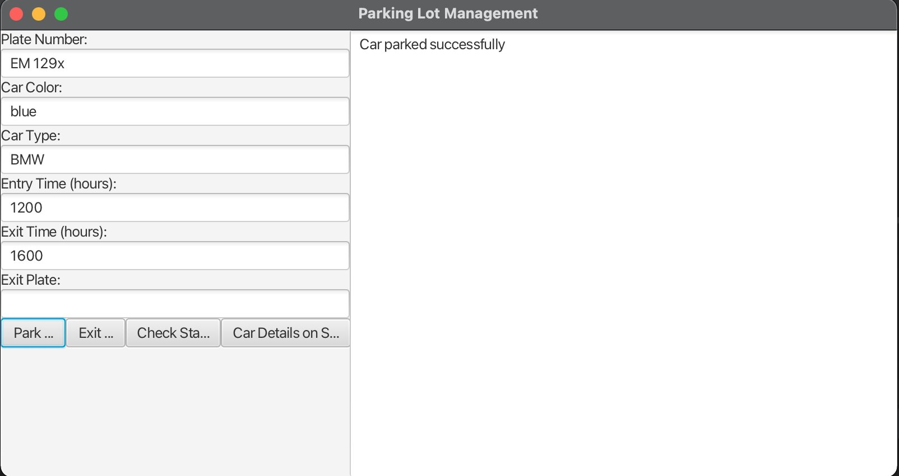
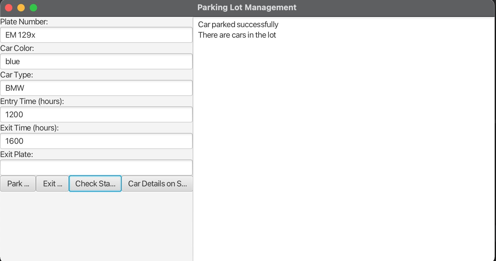
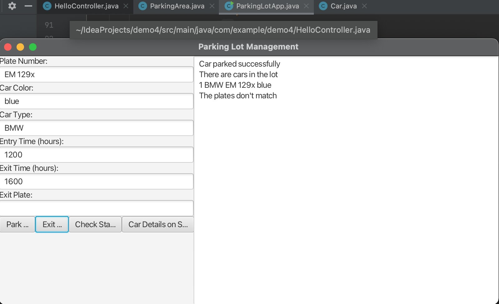
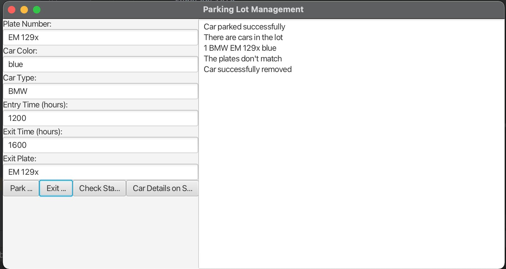

# Parking Lot Management System

## Overview

The Parking Lot Management System is a project designed to streamline and optimize the management of parking lots.
It provides features such as real-time monitoring, space availability tracking, and user-friendly interfaces for both administrators and users.

## Features

- **Real-time Monitoring:** Keep track of the parking lot status in real time.
- **Space Availability:** Easily find available parking spaces.
- **Reporting:** Generate List of cars in the parking lot
- **Safety:** Only cars with matching plate will be allowed to exit

## Technologies Used
-Java
- Frontend: JavaFx
- Intellij 
## Installation
clone the repository
https://github.com/isaacjayden24/parkingLot_system.git

  

